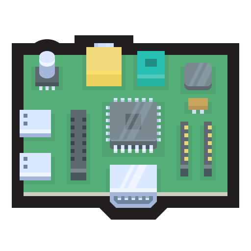

<!-- Improved compatibility of back to top link: See: https://github.com/othneildrew/Best-README-Template/pull/73 -->
<a name="readme-top"></a>
<!--
*** Thanks for checking out the Best-README-Template. If you have a suggestion
*** that would make this better, please fork the repo and create a pull request
*** or simply open an issue with the tag "enhancement".
*** Don't forget to give the project a star!
*** Thanks again! Now go create something AMAZING! :D
-->


<!-- PROJECT SHIELDS -->
<!--
*** I'm using markdown "reference style" links for readability.
*** Reference links are enclosed in brackets [ ] instead of parentheses ( ).
*** See the bottom of this document for the declaration of the reference variables
*** for contributors-url, forks-url, etc. This is an optional, concise syntax you may use.
*** https://www.markdownguide.org/basic-syntax/#reference-style-links
-->
<div align="center">

[![Stargazers][stars-shield]][stars-url]
[![Issues][issues-shield]][issues-url]
[![MIT License][license-shield]][license-url]

</div>


<!-- PROJECT LOGO -->
<br />
<div align="center">
  <a href="https://github.com/Valendrew/pihole-wireguard-gen">
    
  </a>

<h3 align="center">Pi-hole + Wireguard </h3>

</div>


<!-- TABLE OF CONTENTS -->
<details>
    <summary>Table of Contents</summary>
    <ol>
        <li>
        <a href="#about-the-project">About The Project</a>
        <ul>
            <li><a href="#built-with">Built With</a></li>
        </ul>
        </li>
        <li>
        <a href="#getting-started">Getting Started</a>
        <ul>
            <li><a href="#containers-configuration">Containers configuration</a></li>
            <li><a href="#pi-gen-configuration">pi-gen configuration</a></li>
        </ul>
        </li>
        <li><a href="#usage">Usage</a></li>
        <li><a href="#post-setup">Post setup</a></li>
        <li><a href="#todo">TODO</a></li>
        <li><a href="#license">License</a></li>
        <li><a href="#contact">Contact</a></li>
        <li><a href="#acknowledgments">Acknowledgments</a></li>
    </ol>
</details>


<!-- ABOUT THE PROJECT -->
## About The Project

TODO

<p align="right">(<a href="#readme-top">back to top</a>)</p>


### Built With

* [![Pihole][Pihole]][Pihole-url]
* [![Wireguard][Wireguard]][Wireguard-url]
* [![Pigen][Pigen]][Pigen-url]

<p align="right">(<a href="#readme-top">back to top</a>)</p>


<!-- GETTING STARTED -->
## Getting Started

To get a local copy up and running follow these example steps.

* Clone
  ```sh
  git clone --recurse-submodules URL
  ```

### Containers configuration

Create a `.env` file at `stage2-custom/00-docker/files`, with a structure as follows:

| Variable           | Description                                     |
| ------------------ | ----------------------------------------------- |
| DEVICE_IP          | IP address of the device                        |
| WIREGUARD_HOST     | The public hostname of the VPN server[[1]](#1)  |
| WIREGUARD_PASSWORD | Password for the WireGuard Web UI[[1]](#1)      |
| WIREGUARD_PORT     | The host public UDP port for WireGuard[[1]](#1) |
| PIHOLE_PASSWORD    | Password for Pi-hole Web UI[[2]](#2)            |
| PIHOLE_PORT        | Port for Pi-hole Web UI[[2]](#2)                |
| PIHOLE_API_KEY     | API key for Pi-hole[[2]](#2)                    |
| HOMEPAGE_PORT      | Port for the homepage WEB UI[[3]](#3)           |

<a id="1">[1]</a>: [Wireguard options](https://github.com/wg-easy/wg-easy?tab=readme-ov-file#options).

<a id="2">[2]</a> : [Pi-hole options](https://github.com/pi-hole/docker-pi-hole?tab=readme-ov-file#environment-variables).

<a id="3">[3]</a> : [Homepage options](https://gethomepage.dev/latest/installation/docker/).

Note: The variable `PIHOLE_API_KEY` is set only after containers have been created, by generating the key at `Pi-hole WEB UI -> Settings -> API -> Show API token`.

### pi-gen configuration

Create a `.config` file in the root directory, with a structure as explained in the [Pi-gen documentation](https://github.com/RPi-Distro/pi-gen)

Note: A configuration file example is provided in the root directory as `.config.example`, which can be renamed to `.config`, and used as is after editing the empty variables.

| Variable              | Description                 |
| --------------------- | --------------------------- |
| PUBKEY_SSH_FIRST_USER | SSH public key for the user |
| SSH_PORT              | SSH port                    |


<!-- USAGE EXAMPLES -->
## Usage

Create the image
```sh
   ./build-image.sh
```
<p align="right">(<a href="#readme-top">back to top</a>)</p>

Flash the image to an SD card using a tool such as [Raspberry Pi Imager](https://www.raspberrypi.org/software/) or [balenaEtcher](https://www.balena.io/etcher/) and insert it into the Raspberry Pi.

## Post setup

- Router configuration
  - Set device IP to `DEVICE_IP` as static
  - Port forward the `DEVICE_IP` in your router to access Wireguard for an external network.
- RaspberryPi configuration
  - You will be prompted to configure the keyboard layout, user and password on first boot.
  - ~~Edit the SSH port by running `sudo nano /etc/ssh/sshd_config` and changing the line `#Port 22` to `Port SSH_PORT`.~~
- Create the containers
  - Run `docker compose up -d` in `~/project/docker` to create the containers.
  - Generate the API key for Pi-hole at `Pi-hole WEB UI -> Settings -> API -> Show API token` and set it in the `.env` file.
  - Restart the containers by running `docker compose restart` in `~/project/docker` to apply the changes.

Access at the homepage at `http://DEVICE_IP:HOMEPAGE_PORT`, from where you can access the Pi-hole and Wireguard WEB UIs.

<!-- ROADMAP -->
## TODO

- [x] Edit SSH port directly in `stage2-custom` instead of post setup

<p align="right">(<a href="#readme-top">back to top</a>)</p>

<!-- LICENSE -->
## License

Distributed under the MIT License. See `LICENSE.txt` for more information.

<p align="right">(<a href="#readme-top">back to top</a>)</p>

<!-- CONTACT -->
## Contact

Contact me for any questions or suggestions at [LinkedIn](www.linkedin.com/in/andrea-valente-9b07b4139)

<p align="right">(<a href="#readme-top">back to top</a>)</p>


<!-- ACKNOWLEDGMENTS -->
## Acknowledgments

* []() Logo designed by Hopstarter from Flaticon
* []() Pi-hole, Wireguard and pi-gen

<p align="right">(<a href="#readme-top">back to top</a>)</p>


<!-- MARKDOWN LINKS & IMAGES -->
<!-- https://www.markdownguide.org/basic-syntax/#reference-style-links -->
[stars-shield]: https://img.shields.io/github/stars/Valendrew/pihole-wireguard-gen.svg?style=for-the-badge
[stars-url]: https://github.com/Valendrew/pihole-wireguard-gen/stargazers
[issues-shield]: https://img.shields.io/github/issues/Valendrew/pihole-wireguard-gen.svg?style=for-the-badge
[issues-url]: https://github.com/Valendrew/pihole-wireguard-gen/issues
[license-shield]: https://img.shields.io/github/license/Valendrew/pihole-wireguard-gen.svg?style=for-the-badge
[license-url]: https://github.com/Valendrew/pihole-wireguard-gen/blob/master/LICENSE.txt

[Pihole]: https://img.shields.io/badge/Pi%E2%80%93Hole-5c5c5c?style=for-the-badge&logo=pihole&logoColor=white
[Pihole-url]: https://pi-hole.net/
[Wireguard]: https://img.shields.io/badge/wg%E2%80%93easy-88171a?style=for-the-badge&logo=pihole&logoColor=white
[Wireguard-url]: https://github.com/wg-easy/wg-easy
[Pigen]: https://img.shields.io/badge/pi%E2%80%93gen-8cc04b?style=for-the-badge&logo=raspberrypi&logoColor=white
[Pigen-url]: https://github.com/RPi-Distro/pi-gen